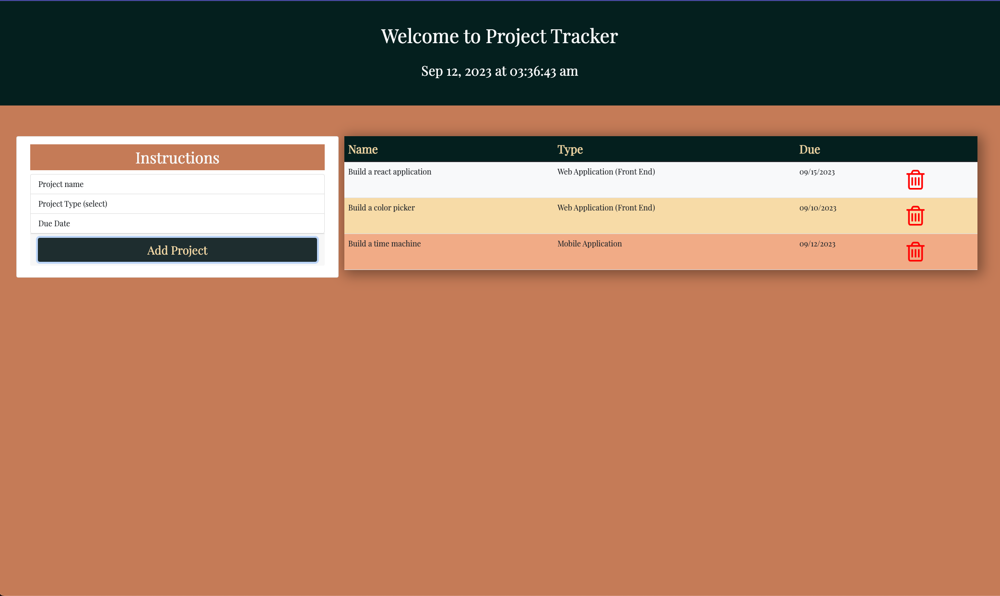
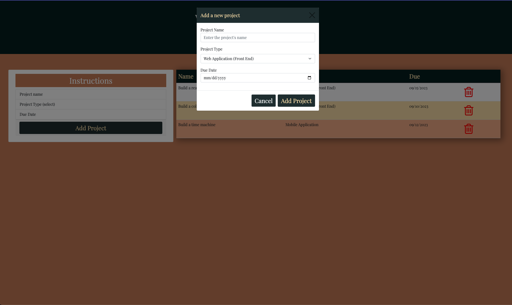

# tracker-project

This app is a project tracker application

## Description

### This Project Tracker application was build with HTML, CSS, JavaScript/Jquery, Dayjs and Bootstrap. You are able to add a project through a modal and save it in localStorage for data persistance and you can also delete it as you please.

## Goal

### The goal of this project was to enhanced my bootstrap and Jquery skills. I was a fun project nevertheless and I feel more confident using them both.

## Live App

[Deployed App](https://dodor101.github.io/tracker-project/)

## Screenshots

 

## Author

# Duckenson Dodor
